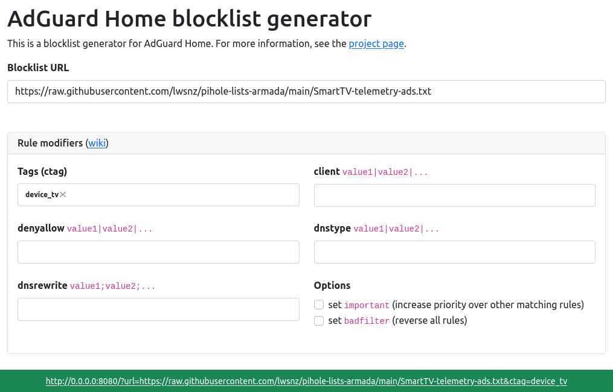

AdGuard Home blocklist generator
===

AdGuard Home blocklist generator is a tool to generate a formatted blocklist for [AdGuard Home](https://github.com/AdguardTeam/AdGuardHome) from a URL. It accepts a variety of input formats, including:

- Plain line-separated list of domain names
- A hosts-formatted list (eg `0.0.0.0 example.com`)
- AdGuard-formatted lists

It allows you to append [AdGuard rule modifiers](https://github.com/AdguardTeam/AdGuardHome/wiki/Hosts-Blocklists#modifiers) to the generated blocklist to allow for more specific filtering, such as ctags, clients etc.

It comes with a simple command line interface and a web interface. The web interface also enables you to configure a blocklist and rule modifiers, and provides you with a reusable URL which you can then configure AdGuard Home to use. The CLI allows you to download and manipulate the original blocklist on the same manner, however is only useful for saving a blocklist to the filesystem.


## Usage

### Web interface

To start the web interface, simply run `adguard-home-bg server [-l <listen interface:port>]`. By default it listens on `0.0.0.0:8080`.




### Command line interface (CLI)

```
Usage:
  adguard-home-bg <blocklist-url> [flags]
  adguard-home-bg [command]

Available Commands:
  server      Run the HTTP server
  version     Display the current version & update information

Flags:
  -t, --ctag string         [value1,value2,...]
  -c, --client string       [value1,value2,...]
      --denyallow string    [value1,value2,...]
      --dnstype string      [value1,value2,...]
      --dnsrewrite string   [value1,value2,...]
  -i, --important           increase priority over other rules without modifier
  -b, --badfilter           disable all rules
  -o, --output string       save output to file (default: stdout)
  -h, --help                help for adguard-home-bg
```

## Docker

The server can be run as a Docker container. Please see [https://hub.docker.com/r/axllent/adguard-home-bg](https://hub.docker.com/r/axllent/adguard-home-bg) for more information.


## Note

This project is not affiliated in any way with [AdGuard](https://adguard.com/). 
